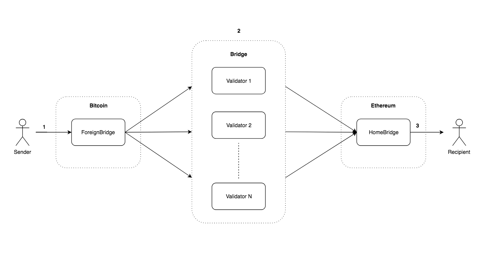
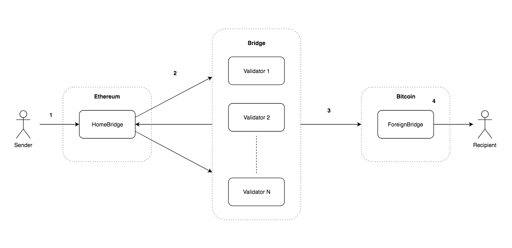

## Background
Terra-Bridge-BTC is a protocol for interchain transfers between Ethereum and Bitcoin.

### Purpose
The purpose of this proposal is to establish in details the mechanism for permission-less transferring of assets between Ethereum and Bitcoin.

### Usecases
Cross-chain transfer between Ethereum and Bitcoin is useful in fields such as:
- **Stable coins**: External chain assets such as BTC could diversify the collaterals used in stable currencies on Ethereum.

- **Decentralized exchange**: Ability to transfer external assets onto Ethereum expands the available assets for trading.

- **Financial derivatives**: Interconnecting blockchain based assets opens up possibilities for various financial derivative products.

### Existing works
There are some existing solutions that exists in this field such as the [Parity Bridge](https://github.com/paritytech/parity-bridge), [PoA Bridge](https://github.com/poanetwork/poa-bridge). However, these solutions are not meant to bring assets onto Ethereum, but rather scalability solutions for EVM based side-chains. Therefore these solutions are limited to EVM <-> EVM transfers under a permissioned authority based schema.

[BTC Relay](https://github.com/ethereum/btcrelay) was one of the first attempts to bring external asset (BTC) onto Ethereum, But it's design limits it's potential to only a one-way relay from BTC to Ethereum, and the costs of relays and lack of proper incentive has rendered the project quiet.

### Design Goals
Our goals for the design of the bridge are:

  - **Two-way transfer support**: The bridge should support two-way transfer of assets between Ethereum and Bitcoin.

  - **Standardized Interface**: The bridge should follow a standardized interface for easy integration purposes.

  - **Permission-less**: The bridge should function under a non-authority based security model.

## Bridge Design

### Terminologies

*Home* - The chain where we are transferring external assets onto in the form of pegged tokens (i.e Ethereum).

*Foreign* - The chain where we are transferring assets from and onto home (i.e Bitcoin).

*Bridge* - The system that helps to perform message relay, verification, and hold/release of assets between users on home and foreign.

*Validator* - Role that runs bridge client. Similar to miners of traditional PoW chains.

## Overview

The bridge is a two way pegging mechanism that works through a rotating validator set and two bridge contracts (“contract” here refers to an executable piece of logic in the context of its residing chain). The bridge contracts resides on the home and foreign chains, hereon referred to as home-bridge and foreign-bridge.

The bridge contracts must be able to accepts and lock funds, verifies cryptographic signature of incoming cross-chain transfer transactions, and release token to user address on successful transfers. The relay of messages between the two bridges on different chains happen in a byzantine fault tolerant way by the bridge validators.

Foreign -> Home Transfer Flow:



1. User deposits BTC into the foreign-bridge. The transaction contains metadata for validators to relay the transfer:
  - *T* - transfer amount
  - *R* - recipient address on home
3. Validators (1 to N) queries and find new incoming transactions on foreign-bridge and send message to home-bridge to relay transfer with the following parameters:
  - *R* - recipient address on home.
  - *T* - transfer amount
  - *SIG* - validator signature of transfer transaction
4. The home bridge receives the incoming message, verifies validator signature and keeps track of the signatures collected from validators. When more than N/2 validator signatures are collected for a given *TX* then *T* amount BTCT (pegged version of BTC on Ethereum in the form of token) is transferred to recipient.

Home -> Foreign Transfer Flow:



1. User deposits BTCT into home-bridge. The transaction contains metadata for validators to relay the transfer:
  - *T* - transfer amount
  - *R* - recipient address on foreign
2. Validators (1 to N) listens for events and find new incoming transaction on home-bridge and send message to home-bridge to collect signatures approving the transfer with the following parameters:
  - *R* - recipient address on foreign.
  - *T* - transfer amount
  - *SIG* - validator signature of transfer transaction
3. Once enough signatures are collected (N/2 + 1) and verified, home-bridge emits event to inform validators the transfer has been fully approved. The last validator to submit the transfer transaction to foreign-bridge along with the collected validator signatures.
4. The foreign bridge receives the incoming transfer request, verifies the collected signatures and *T* amount BTC is transferred to recipient.

### Number of Transactions for Transfer
**Bitcoin -> Ethereum**: 1 initial user transfer request tx on Bitcoin + (N/2 + 1) validator transfer relay tx on Ethereum.

**Ethereum -> Bitcoin**: 1 initial user transfer request tx on Ethereum + (N/2 + 1) signature collection transaction on Ethereum + 1 transfer relay transaction on Bitcoin.

## Validator Selection Criteria
Through the choice of a BFT consensus mechanism with validators formed from a set of stakeholders determined by depositing stakes in the bridge staking contracts, we are able to get a secure consensus with an infrequently changing and modest number of validators.

Any validators that deposits the stake will become a validator in the next block. Similarly any validator that withdraws from the contract will have their validator status revoked in the following block. A participating validator must register via deposits in the bridge contract on both home and foreign. Since home is Ethereum, the staking and update of validators is straight forwards. For foreign is slightly more complicated due to Bitcoin's limited functionalities.

## Consensus
Any transfer requests with approval from *N/2 + 1* validators are finalized. This process continues indefinitely unless *N/2* or more validators become unresponsive, in which case the bridge halts.

## Security Assumptions
The bridge is secure as long as the attacker controls less than 51% of the validator pool.

## Rewarding and Slashing
Validators are incentivized to stay online and contribute to the bridge's security by relaying transfer requests for transfer fee rewards. For each relayed transfer message, the relaying validator earn a portion of the corresponding transfer fee. At the same time, to prevent validators from going offline without revoking their validator status (i.e withdraw their stake), a slashing mechanism is put in place. If a validator fails to perform the relay for a transfer message, he will get slashed a portion of his deposited stake.

TODO:
- how fee works (need payment transferring both ways)
  - pooled fee address for Bitcoin
  - distributed fee for Ethereum
- how to proof validator missing tx for slashing

## Home (Ethereum) Bridge Implementation
The home bridge will be written in Solidity and ran on EVM.

The home bridge will have the following interface:
- `transferToForeign(address recipient, uint amount)`

Events:
- `TransferToForeign (address recipient, uint256 value)`
- `TransferFromForeign (address recipient, uint256 value, bytes32 transactionHash);`

### Transferring Funds
Dapps or contract could call the `payable` function of `transferToForeign` for making cross-chain transfers, and listen on `TransferToForeign` and `TransferFromForeign` for transfer results.

### Home Token
The pegged token used on home chain to represent foreign token aka HomeToken will be a [Mintable](https://github.com/OpenZeppelin/openzeppelin-solidity/blob/v1.12.0/contracts/token/ERC20/MintableToken.sol) and [Burnable](https://github.com/OpenZeppelin/openzeppelin-solidity/blob/v1.12.0/contracts/token/ERC20/BurnableToken.sol) ERC20 token. The mintable and burnable properties or the token allows easy management of the pegged token. It can be transferred to the home bridge and destoryed on transfer outs (to foreign), and created and sent to recipient on transfer ins (from foreign).

### Verifying Bitcoin Signature on Ethereum
As part of the `transferToForeign` request, the bridge contract needs to be able to verify the Bitcoin transaction signatures collected from  bridge validators. Fortunately we can do this with `ecrecover` function in Solidity since both Ethereum and Bitcoin use the same Elliptic Curve Digital Signature Algorithm (ECDSA) for signing.

## Foreign (Bitcoin) Bridge Implementation
The implementation of the foreign bridge on Bitcoin will be achieved using a multisignature address. We can achieve this using a M-of-N P2SH multisignature address according to [BIP-13](https://github.com/bitcoin/bips/blob/master/bip-0013.mediawiki). The Bitcoin reference implementation has validations rules limiting the P2SH redeem script to be at most 520 bytes, meaning that the length of all public keys together plus the number of public keys must not this byte limit. For compressed public keys, this means up to N=15.

The redeem script according to [BIP-16](https://github.com/bitcoin/bips/blob/master/bip-0016.mediawiki) can be constructed using the `OP_CHECKMULTISIG` opcode in of the format:

```
[M pubkey-1 pubkey-2 ... pubkey-N OP_CHECKMULTISIG]
```

In order to increase the upper bound of the validator set we could utilize the SegWit's `witnessScript`, which in Bitcoin Core 0.13.1 and up allows up to 3600 bytes of script data. Following  [BIP-141](https://github.com/bitcoin/bips/blob/master/bip-0141.mediawiki), we can construct a the P2SH-P2WSH (P2SH with SegWit) multisignature redeem script using the `OP_CHECKSIG` opcode in the following format:
```
<pubkey1> OP_CHECKSIG
OP_SWAP <pubkey2> OP_CHECKSIG OP_ADD
OP_SWAP <pubkey3> OP_CHECKSIG OP_ADD
...
OP_SWAP <pubkey67> OP_CHECKSIG OP_ADD
<m> OP_NUMEQUALVERIFY
```

### Transferring Funds
To send transfer, users could just send BTC to the multisig address.

### Validator Rotation
The challenge with Bitcoin is how the deposits can be securely controlled from a rotating validator set.

TODO:
- Create new multisig and transfer fund?

Since the ultimate security of the deposits rests with a number of bonded validators, one other option is to reduce the multi-signature key-holders to only a heavily bonded subset of the total validators.

### Achieving Consensus on Ouput Tx for Multisig Redemption
TODO
